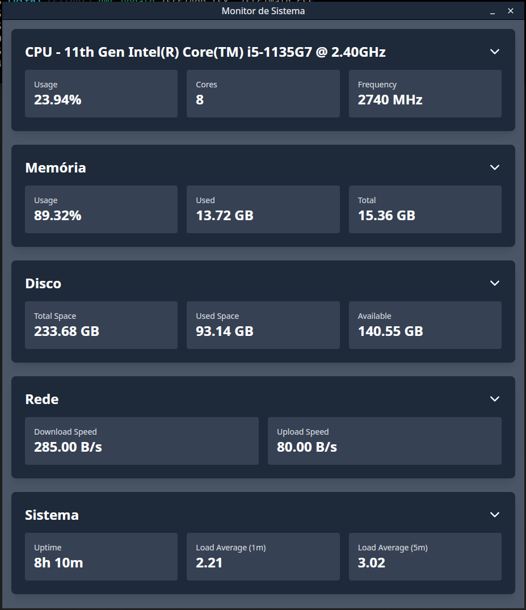
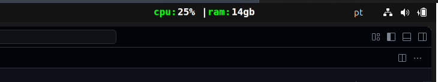

# System Monitor App

Um monitor de sistema moderno desenvolvido com **Tauri**, **React** e **Rust**, que oferece monitoramento em tempo real dos recursos do sistema com uma interface elegante e um ícone de bandeja do sistema dinâmico.

## 🚀 Recursos

- **Monitoramento em Tempo Real**: CPU, Memória, Disco e Rede
- **Ícone Dinâmico na Bandeja**: Exibe CPU e RAM em tempo real no tray
- **Interface Moderna**: Design limpo com Tailwind CSS
- **Multi-plataforma**: Windows, macOS e Linux
- **Performance Otimizada**: Backend em Rust para máxima eficiência
- **SVG Dinâmico**: Geração de ícones vetoriais para melhor qualidade

## 📸 Screenshots

### Interface Principal


### Ícone na Bandeja do Sistema


## 🛠️ Tecnologias Utilizadas

- **Runtime**: Deno 2.0+
- **Frontend**: React 18 + TypeScript + Tailwind CSS v4
- **Backend**: Rust + Tauri v2
- **Gráficos**: React Google Charts
- **Ícones**: React Icons
- **Build Tool**: Vite

## 📋 Pré-requisitos

- Deno (versão 2.0 ou superior)
- Rust (versão 1.70 ou superior)
- Sistema operacional: Windows, macOS ou Linux

## ⚡ Instalação e Execução

### 1. Clone o repositório
```bash
git clone <url-do-repositorio>
cd system-monitor-app
```

### 2. Instale as dependências
```bash
deno install
```

### 3. Execute em modo de desenvolvimento
```bash
deno task tauri dev
```

### 4. Build para produção
```bash
deno task tauri build
```

## 🎨 Funcionalidades

### Monitor de Sistema
- **CPU**: Porcentagem de uso, frequência e número de cores
- **Memória**: RAM total, usada, disponível e porcentagem
- **Disco**: Espaço total, usado, livre e porcentagem por drive
- **Rede**: Velocidade de download e upload em tempo real
- **Sistema**: Informações do OS, hostname e uptime

### Ícone da Bandeja
- Atualização automática a cada 500ms
- Exibe `cpu:XX%|ram:XXgb` no formato texto
- Cores personalizáveis (verde para labels, branco para valores)
- Fonte monospace para melhor legibilidade
- Geração SVG para qualidade superior

### Interface do Usuário
- Design responsivo e moderno
- Tema escuro elegante
- Controles de janela customizados (minimizar/fechar)
- Gráficos interativos para visualização de dados
- Barra de título arrastável

## 🏗️ Estrutura do Projeto

```
system-monitor-app/
├── src/                    # Frontend React
│   ├── components/         # Componentes React
│   │   ├── cpu.tsx
│   │   ├── memory.tsx
│   │   ├── disk.tsx
│   │   ├── network.tsx
│   │   └── system.tsx
│   ├── App.tsx            # Componente principal
│   ├── interfaces.ts      # Tipos TypeScript
│   └── main.tsx          # Entry point
├── src-tauri/             # Backend Rust
│   ├── src/
│   │   ├── main.rs       # Main Tauri app
│   │   ├── lib.rs        # Library exports
│   │   └── monitor.rs    # System monitoring logic
│   └── tauri.conf.json   # Configuração do Tauri
├── images-app/           # Screenshots
└── README.md
```

## 🔧 Configuração

### Tailwind CSS
O projeto usa Tailwind CSS v4 com configuração no `vite.config.ts`:

```typescript
import tailwindcss from "@tailwindcss/vite";

export default defineConfig({
  plugins: [react(), tailwindcss()],
  // ...
});
```

### Tauri
Configurações principais em `src-tauri/tauri.conf.json`:
- Ícone da bandeja habilitado
- Janela sem decorações nativas
- APIs de sistema habilitadas

## 🚀 Build e Distribuição

### Desenvolvimento
```bash
deno task dev          # Frontend apenas
deno task tauri dev    # Aplicação completa
```

### Produção
```bash
deno task build        # Build do frontend
deno task tauri build  # Build completo com executável
```

Os executáveis serão gerados em `src-tauri/target/release/`.

## 🤝 Contribuindo

1. Faça um fork do projeto
2. Crie uma branch para sua feature (`git checkout -b feature/nova-feature`)
3. Commit suas mudanças (`git commit -m 'Adiciona nova feature'`)
4. Push para a branch (`git push origin feature/nova-feature`)
5. Abra um Pull Request

## 📝 Licença

Este projeto está sob a licença MIT. Veja o arquivo `LICENSE` para mais detalhes.

## 🐛 Issues e Suporte

Encontrou um bug ou tem uma sugestão? Abra uma issue no repositório!

---

Desenvolvido com ❤️ usando Tauri + React + Rust